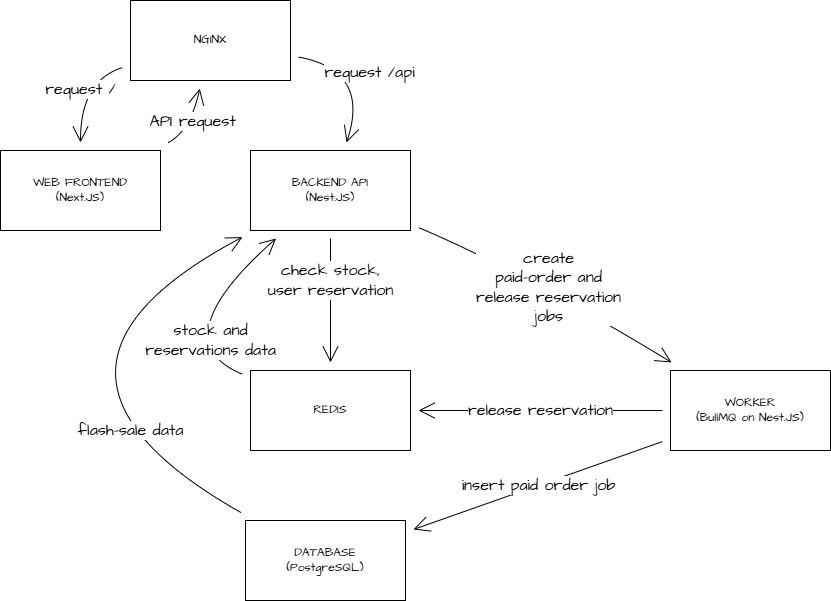

# Project Wombat

## About The Project

This project is to simulate flash-sale situtation, where we have limited stocks of product and a huge number of users. This project supposed to be simple, not production-ready, only simulate a different approach that can be taken to prevent abuse on the backend itself. To simplify authentication, this app treat different username as different user. Each user can only buy one item.

Caveat when running application: This application is designed for demo-purposes, so in order to get consistent result, the system will **wipe `orders` data + reset `flash-sale` data on database and wipe all redis key used in this project (prefixed with `wombat:`) on every application start**. No, this doesn't mean running this app will wipe all your databases and redis key other than that is used by this application.

## System Diagram

This is the current system diagram for this project.



Here are the explanation for each components:

### NGINX

NGINX is routing all requests to frontend (`/` route) or backend (`/api` route). NGINX also apply some rate-limiting per user via `X-User-Id`, falling back to client IP to prevent abuse to the backend system.

### Frontend

Frontend is a simple React application using Next.js framework with Tailwind for styling. I intentionally not applying any logic to enable/disable any button and show the error as-is from the backend since I want to show how backend handle every action from the user (for example, attempting to buy without providing username or try to buy the item more than once).

Frontend will append any request to backend with `X-User-Id` if user fill in their username.

### Backend

Backend interacts with 3 other components: PostgreSQL as database, Redis as caching system, and BullMQ as worker queue. Most of the parameter used by backend service is exposed to environment variable via `.env` file. Here are some of the parameters and its usage:

```bash
# the ID of the flash-sale. to make it easy to inspect, we use varchar instead of UUID.
FLASH_SALE_ID = main

# flash-sale product name, this is not important since it's not exposed anywhere. I put this only to seed the database when app first start.
FLASH_SALE_PRODUCT_NAME = Limited Edition Product

# total stock of the item
FLASH_SALE_TOTAL_STOCK = 100

# delay when flash-sale will start after we run the application. this to simulate `upcoming` state when user call for `/api/flash-sale/status` endpoint
FLASH_SALE_START_DELAY_SECONDS = 10

# how long flash-sale will go
FLASH_SALE_DURATION_SECONDS = 1800

# reservation window for user to make a payment. default to 5 minutes. after that, user may attempt to buy again if fail to make a purchase
FLASH_SALE_RESERVATION_TTL_SECONDS = 300

# maximum attempt user to call `api/flash-sale/buy` before considered as abusive. currently very strict
FLASH_SALE_USER_ATTEMPT_LIMIT = 5

# a window to count user attempt. combining with previous parameter, it means user that call `api/flash-sale/buy` endpoint more than FLASH_SALE_USER_ATTEMPT_LIMIT in FLASH_SALE_ATTEMPT_WINDOW_SECONDS is considered abusive and will put into cooldown mode
FLASH_SALE_ATTEMPT_WINDOW_SECONDS = 60

# colldown time applied
FLASH_SALE_COOLDOWN_TTL_SECONDS = 60

# currently only 30% of payment request will success.
FLASH_SALE_PAYMENT_SUCCESS_RATE = 0.3
```

Backend exposes four endpoints:

| Method | Path                     | Purpose                                                              | Request body / query                                  |
| ------ | ------------------------ | -------------------------------------------------------------------- | ----------------------------------------------------- |
| `GET`  | `/api/flash-sale/status` | Return sale lifecycle, total stock, available slots, and time window | None                                                  |
| `POST` | `/api/orders/buy`        | Reserve a payment slot if the sale is active and user is eligible    | JSON: `{ "username": "..." }`                         |
| `POST` | `/api/orders/pay`        | Complete payment for an existing reservation                         | JSON: `{ "username": "...", "reservationId": "..." }` |
| `GET`  | `/api/orders/status`     | Return whether user is `none`, `reserved`, or `paid`                 | Query: `?username=...`                                |

### Redis

Since we are dealing with a huge number of users, I design the application to use reservations to manage race conditions. We manage the reservations, stock-keeping, user buy-attempt (for rate-limit), and user cooldown on Redis. I choose this because it is fast and we can run atomic operation to make sure that we only create paid-order job when all requirements are fullfiled (user has never bought the item, user has an active reservation, and user has already made payment).

### Worker Queue

To offload some of the job from the main backend threads, we utilize queue (we use BullMQ on Nest.JS since we are dealing with Node.js only application for now and Nest.JS supports it out of the box) to release user's reservation and to persist order to the database. We use `upsert` when inserting order data to dabase, since the job will retry if DB fails to write the data.

### Database

We use postgres to store the flash-sale and orders data. Since we want to prevent over-ordering problem and hold the source-of-truth of user orders in this database, we applied some heavy prevention for it by managing the stock-keeping on Redis and use worker queue to write order.

## Design Choices & Trade-Offs

This part is based on this application running on Docker using docker compose. Local development might have different outcome, since we use local Redis and PostgreSQL.

NGINX acts as the single public entrypoint and reverse proxy, simulating a simplified edge layer similar to an ingress, API gateway, or load balancer with path-based routing. This doesn't really simulate one-to-one for load balancing, since current approach only register one upstream API via:

```bash
upstream api {
    server api:3100;
}
```

We can further simulate load-balancer if we list multiple API server, like:

```bash
upstream api {
    server api:3100;
    server api:3200;
}
```

But this means that we will have multiple containers of API service, which we are currently not implementing.

Since Redis manages all available reservation slots, user reservations, user buy attempts, and user purchases, Redis feels like the biggest contributor of this project. The trade-off is, Redis failure will make backend return 500 error to every endpoints. We did apply AOF (append-only-file), so when Redis is back online, the data is reserved. In production scenario, using replication for Redis is a primary requirement.

If for some reason, database is failing before persisting orders data from queue, the queue will retry the job up to 10 times with a exponential delay in-between.

## Build & Run Instructions

All of the solution is running on the same docker compose stack, consisting of several container (further explanation on design choices and trade-offs). You can also manually run every service on it's own to inspect everything. When application is running on docker compose, I intentionally expose redis's and postgresql's port so you can inspect the data without having to execute command inside the container itself.

### Pre-requisite

Duplicate `.env.example` file and rename it as `.env`. You can tweak the value according to your needs.

#### Running on Docker

This is the most straightfroward way to run this application with its all dependencies. Make sure you have Docker installed and running.

Docker compose will read `.env`, so make sure you already tweak the parameters if needed.

1. To build and run the application, run `docker compose up --build` inside the project's root folder. This will download all image needed, build `api`, `web`, and `worker` and run all containers accordingly.
2. Open `http://localhost:88` (or other port defined in `NGINX_PORT`) to run the application.

#### Running locally

Make sure you have local Redis running on port 6379 and local PostgreSQL running on port 5432 before proceed. If you have them running on different ports, you can either change the port for database in `\apps\api\src\database\database.module.ts` and for Redis in `apps\api\src\redis\redis.module.ts`. We hardcoded this value for simplicity since it is intended to run on Docker. The `REDIS_PORT` and `DATABASE_PORT` in `.env` file is for exposing db and redis to outside Docker.

1. Run `pnpm install` in the root of project directory to install dependencies. If you don't have PNPM, [see here](https://pnpm.io/installation).

2. To run backend service, run `pnpm nx serve api`.

3. To run worker queue service, run `pnpm nx serve worker` in a different terminal.

4. To run frontend service, run `pnpm nx dev web` in a different terminal.

5. Open application on `http://localhost:3000`

## Stress Test Instructions

We use k6 to stress test this application. You can see the scenario on `loadtest\k6\scenario.js`. We will read all parameters on `.env.loadtest`. You can tweak the parameters if simulate different scenario (for example, increase the number of users, decrease payment window, make only 10% of payment will success, etc.). I designed the stress test to also run using Docker compose, since we need to simulate web firewall and run k6.

We also add a WAF layer in front of NGINX that is missing from normal execution. This is intentional, since we want to simulate having firewall furing stress test, but not during normal execution.

### Running the Test

To run the stress test, you just need to run `pnpm run loadtest:run`. The script will remove any of previous test run containers (if any), build all required docker image, and run the containers.

### Inspecting Redis and Database

You can inspect the Redis and Postgres DB when test is running by connecting to port `6381` for Redis and `5436` for Postgres. We use `project-wombat-loadtest` database in PostgreSQL.

### Ending the Test

After test has been executed, I intentionaly keep all containers running except k6 and collector in case you want to inspect the logs and other things.

To destroy the containers completely, run `pnpm run loadtest:down`.

### Inspecting the Result

After running the test, the result can be seen on `/loadtest/artifacts/{datetime}` folder. Inside the folder, you can see several files:

- `.env.loadtest` file so you can see which parameters are used during the test
- `final-report.json` and `final-report.txt` generated aggregated report from NGINX, WAF, Redis, PostgreSQL, and k6. TXT version is a little bit nicer, but JSON version is more structured.
- `k6-summary.json` and `k6-summary.txt`

The `final-report.json` report is pretty self-explanatory, but here's the detail:

- `stock`
  Total flash-sale stock configured for this run.

- `nginx`
  Summary from proxy logs.
  - `totalRequests`: all requests seen by NGINX.
  - `throttledCount` / `throttledPercent`: requests rate-limited by NGINX.
  - `statusBuckets`: final HTTP responses returned to clients.
  - `upstreamBuckets`: responses coming back from backend.
    `"-"` means NGINX blocked request before forwarding upstream.
  - `routeBreakdown`: stats split by endpoint.

- `waf`
  Summary from ModSecurity audit logs.
  - `totalAudits`: total WAF audit entries analyzed.
  - `blockedCount` / `blockedPercent`: requests blocked by WAF.
  - `topRuleIds`: most-triggered WAF rules.
  - `topTags`: most common WAF tags/categories.

- `redis`
  Runtime state left in Redis after test.
  - `availableSlots`: remaining stock slots.
  - `reservationRecordCount`: active reservations still present.
  - `paidMarkerCount`: users marked as paid in Redis.

- `postgres`
  Persistent DB state after test.
  - `paidOrdersCount`: number of paid orders actually written to Postgres.

- `k6`
  Load-generator metrics.
  - `checks`: test assertions inside k6.
  - `httpReqs`: total HTTP requests sent.
  - `httpReqFailedRate`: fraction counted as failed by k6.
  - `httpReqDuration`: latency summary.
    `p50`, `p95`, `avg`.
  - `custom`: business-level counters collected by scenario.
    - `buyReserved`: successful reservations
    - `buyThrottled`: rate-limited buy attempts
    - `buyConflict`: rejected buys, usually slot/user conflict
    - `wafBlocked`: WAF-blocked requests
    - `paymentPaid`: successful payments
    - `paymentFailed`: payment simulation failed
    - `paymentExpired`: reservation expired before pay
    - `paymentNotFound`: no active reservation at pay time
    - `paymentConflict`: conflicting pay state
    - `paymentUnexpected`: unexpected payment outcome
    - `logicalFailuresRate`: business-rule failure rate

- `invariants`
  Final correctness checks.
  - `noOversell`: system never sold above stock
  - `redisNonNegative`: Redis stock counter never went below zero
  - `saleDrained`: all stock got consumed
  - `paidOrdersWithinStock`: paid orders did not exceed stock

Here's an example of `final-report.json`:

```json
{
  "generatedAt": "2026-05-11T07:04:53.148Z",
  "stock": 500,
  "nginx": {
    "totalRequests": 18401,
    "throttledCount": 2277,
    "throttledPercent": 12.37,
    "statusBuckets": {
      "200": 6508,
      "201": 2297,
      "404": 71,
      "409": 6970,
      "429": 2555
    },
    "upstreamBuckets": {
      "200": 6508,
      "201": 2297,
      "404": 71,
      "409": 6970,
      "429": 278,
      "-": 2277
    },
    "routeBreakdown": {
      "GET /api/flash-sale/status": {
        "totalRequests": 6508,
        "statusBuckets": {
          "200": 6508
        },
        "upstreamBuckets": {
          "200": 6508
        }
      },
      "POST /api/orders/buy": {
        "totalRequests": 10106,
        "statusBuckets": {
          "201": 581,
          "409": 6970,
          "429": 2555
        },
        "upstreamBuckets": {
          "201": 581,
          "409": 6970,
          "429": 278,
          "-": 2277
        }
      },
      "POST /api/orders/pay": {
        "totalRequests": 1787,
        "statusBuckets": {
          "201": 1716,
          "404": 71
        },
        "upstreamBuckets": {
          "201": 1716,
          "404": 71
        }
      }
    }
  },
  "waf": {
    "totalAudits": 18706,
    "blockedCount": 300,
    "blockedPercent": 1.6,
    "topRuleIds": [
      {
        "ruleId": "1000001",
        "count": 300
      },
      {
        "ruleId": "920350",
        "count": 5
      }
    ],
    "topTags": [
      {
        "tag": "modsecurity",
        "count": 305
      },
      {
        "tag": "loadtest/forced-block",
        "count": 300
      },
      {
        "tag": "application-multi",
        "count": 5
      },
      {
        "tag": "language-multi",
        "count": 5
      },
      {
        "tag": "platform-multi",
        "count": 5
      }
    ]
  },
  "redis": {
    "availableSlots": 0,
    "reservationRecordCount": 0,
    "paidMarkerCount": 500
  },
  "postgres": {
    "paidOrdersCount": 500
  },
  "k6": {
    "checks": {
      "passes": 19415,
      "fails": 0,
      "rate": 1
    },
    "httpReqs": 19001,
    "httpReqFailedRate": 0.5366033366664912,
    "httpReqDuration": {
      "p50": null,
      "p95": 1944.256427,
      "avg": 1278.8763537438101
    },
    "custom": {
      "buyReserved": 581,
      "buyThrottled": 2555,
      "buyConflict": 6970,
      "wafBlocked": 300,
      "paymentPaid": 500,
      "paymentFailed": 1216,
      "paymentExpired": 0,
      "paymentNotFound": 71,
      "paymentConflict": 0,
      "paymentUnexpected": 0,
      "logicalFailuresRate": 0
    }
  },
  "invariants": {
    "noOversell": true,
    "redisNonNegative": true,
    "saleDrained": true,
    "paidOrdersWithinStock": true
  }
}
```
